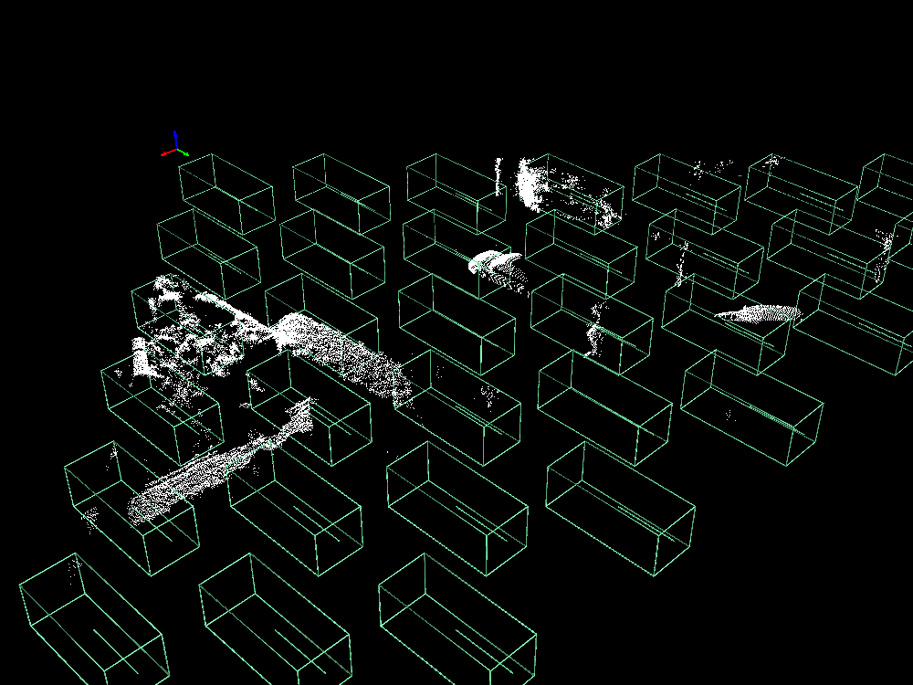

# RSF: Optimizing Rigid Scene Flow From 3D Point Clouds Without Labels

[David Deng](https://davezdeng8.github.io/) and [Avideh Zakhor](http://www-video.eecs.berkeley.edu/~avz/)

[pdf](https://openaccess.thecvf.com/content/WACV2023/papers/Deng_RSF_Optimizing_Rigid_Scene_Flow_From_3D_Point_Clouds_Without_WACV_2023_paper.pdf)

In WACV 2023



## Installation
Our code has the following dependencies:

-PyTorch

-PyTorch3D

-Mayavi

-Scipy

-Matplotlib

-Shapely

Create the conda environment:

```angular2html
conda env create -f environment.yml
conda activate segflow3
```

## Data
Download the data from the following links:

-[StereoKITTI](https://drive.google.com/file/d/1j4-0QINSmqJYseIONSK2hbW_-9DLQ8Ak/view?usp=sharing)

-[LidarKITTI](https://drive.google.com/file/d/1FmBD_c5q0O7JMd9ufKyHkuMg7V0bRR_f/view?usp=sharing)

-[nuScenes](https://drive.google.com/file/d/1mCjDqJzaMdW0iiM2N2J5BNvo04dAvTbx/view)

Extract them into rsf's parent directory 
(rsf and dataset directories are in the same directory)

## Usage
Run 'without_learning2.py' to produce results for StereoKITTI. 
Change the cfg argument to run the other datasets. 

## Citation

If you find our work useful in your research, please consider citing:
```BibTeX
@InProceedings{Deng_2023_WACV,
    author    = {Deng, David and Zakhor, Avideh},
    title     = {RSF: Optimizing Rigid Scene Flow From 3D Point Clouds Without Labels},
    booktitle = {Proceedings of the IEEE/CVF Winter Conference on Applications of Computer Vision (WACV)},
    month     = {January},
    year      = {2023},
    pages     = {1277-1286}
}
```

## Acknowledgements

This code borrows from [Weakly Supervised Learning of Rigid 3D Scene Flow
](https://github.com/zgojcic/Rigid3DSceneFlow).
